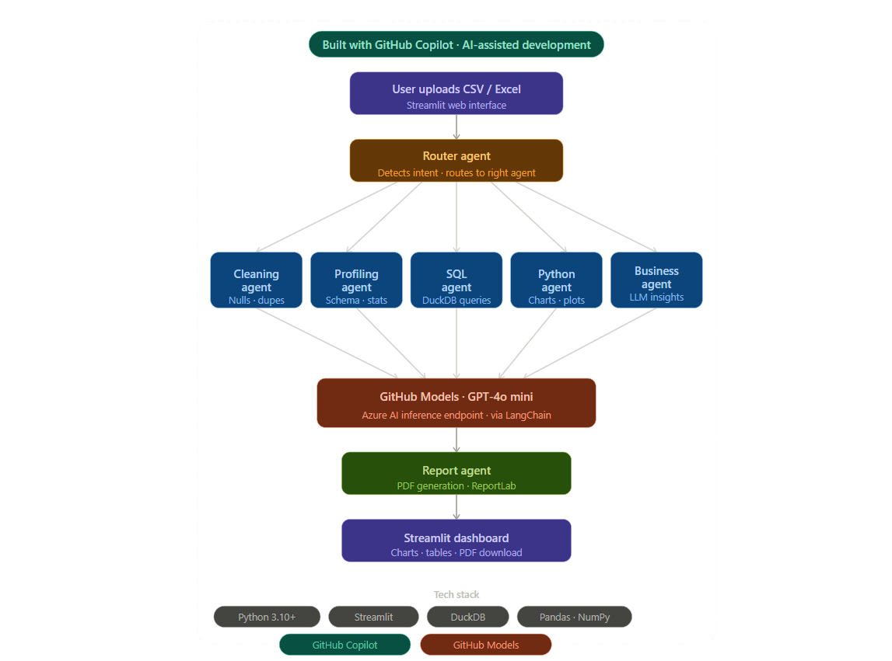

# ⚡ DataPilot AI
### Your Intelligent Data Co-Pilot — From Raw Data to Real Decisions

> 🏆 Submitted for **Microsoft Agents League Hackathon 2026** — Creative Apps Track  
> 🤖 Built with **GitHub Copilot** | Powered by **GitHub Models (GPT-4o mini)**

---

## 🎯 What is DataPilot AI?

DataPilot AI is a fully automated, multi-agent data analysis platform. Upload any CSV or Excel file and the system instantly:

- 🧹 **Cleans** your data — removes duplicates, fixes nulls
- 📋 **Profiles** every column — types, missing %, unique values
- 🗄️ **Runs SQL** — natural language to DuckDB queries
- 📊 **Visualizes** — AI-generated charts and correlation heatmaps
- 💼 **Business Insights** — strategy, risks, opportunities via LLM
- 📄 **PDF Report** — downloadable business report

No coding needed. Just upload and get insights in seconds.

---

## 🏗️ Architecture Diagram



> Built with **GitHub Copilot** (AI-assisted development) · Powered by **GitHub Models** via Azure inference endpoint

---

## 🤖 How GitHub Copilot Was Used

This entire project was developed using **GitHub Copilot** in VS Code as an AI-assisted development tool:

| Area | How Copilot Helped |
|---|---|
| Multi-agent routing logic | Copilot suggested intent detection patterns in `router.py` |
| SQL query generation | Copilot autocompleted DuckDB query patterns in `sql_agent.py` |
| Data cleaning logic | Copilot recommended dtype-aware null filling strategies |
| ReportLab PDF formatting | Copilot generated boilerplate for styles and layout |
| Streamlit UI components | Copilot accelerated dashboard and layout code |
| LangChain integration | Copilot suggested chain patterns for LLM calls |

> GitHub Copilot acted as a **pair programmer** throughout — speeding up development, catching bugs, and suggesting best practices at every step.

---

## 🧠 How It Works — Multi-Agent Architecture

```
User uploads CSV / Excel
         ↓
    Router Agent
   (detects intent from prompt)
         ↓
┌─────────────────────────────────────────┐
│  Cleaning Agent  →  Remove nulls/dups   │
│  Profiling Agent →  Dataset overview    │
│  SQL Agent       →  DuckDB queries      │
│  Python Agent    →  Visualizations      │
│  Business Agent  →  LLM insights        │
│  Report Agent    →  PDF generation      │
└─────────────────────────────────────────┘
         ↓
    GitHub Models
   (GPT-4o mini via Azure inference)
         ↓
  Results shown on screen
  PDF report downloadable
```

---

## ✨ Key Features

| Feature | Description |
|---|---|
| 🤖 Auto Analysis | 5-step analysis runs automatically on upload |
| 🧹 Smart Cleaning | Handles nulls, duplicates, whitespace, all dtypes |
| 🗄️ Natural Language SQL | Type in plain English, get SQL results instantly |
| 📊 AI Visualizations | LLM generates the right chart for your data |
| 💼 Business Insights | Senior consultant-level analysis via GPT-4o mini |
| 📄 PDF Export | Download full business report |
| 💬 Chat Interface | Ask anything about your data |
| 🔄 Multi-file Support | Upload and switch between multiple datasets |

---

## 🛠️ Tech Stack

| Layer | Technology |
|---|---|
| Frontend | Streamlit |
| AI Development | GitHub Copilot (VS Code) |
| LLM | GitHub Models — GPT-4o mini |
| LLM Inference | Azure AI inference endpoint |
| LLM Framework | LangChain |
| SQL Engine | DuckDB |
| Data Processing | Pandas, NumPy |
| Visualization | Matplotlib, Seaborn |
| PDF Generation | ReportLab |
| Language | Python 3.10+ |

---

## 📁 Project Structure

```
DataPilot-AI/
│
├── main.py                  # Main Streamlit app
├── requirements.txt         # Dependencies
├── .env.example             # Environment variables template
├── architecture_diagram.png # Architecture diagram
│
├── agents/
│   ├── router.py            # Intent detection — routes to correct agent
│   ├── cleaning_agent.py    # Data cleaning
│   ├── profiling_agent.py   # Dataset profiling
│   ├── sql_agent.py         # DuckDB SQL execution
│   ├── python_agent.py      # Python/visualization code execution
│   ├── business_agent.py    # LLM business analysis
│   └── report_agent.py      # PDF report generation
│
├── utils/
│   ├── data_loader.py       # CSV/Excel file loader
│   ├── helper.py            # Code extraction utility
│   └── llm.py               # GitHub Models LLM setup
│
└── dashboards/
    └── dashboard.py         # Interactive Streamlit dashboard
```

---

## ⚡ Quick Start

### 1. Clone the repo
```bash
git clone https://github.com/YOUR_USERNAME/DataPilot-AI.git
cd DataPilot-AI
```

### 2. Create virtual environment
```bash
python -m venv venv
venv\Scripts\activate        # Windows
source venv/bin/activate     # Mac/Linux
```

### 3. Install dependencies
```bash
pip install -r requirements.txt
```

### 4. Setup environment variables
```bash
cp .env.example .env
```

### 5. Run the app
```bash
streamlit run main.py
```

---

## 🔑 Environment Variables

`.env` file mein yeh daalo:

```env
# GitHub Models (Primary LLM - Free)
LLM_PROVIDER=github
GITHUB_TOKEN=your_github_personal_access_token_here

# Google Gemini (Optional backup)
GOOGLE_API_KEY=your_gemini_api_key_here
```

**GitHub Token free milta hai:**
1. github.com → Settings → Developer Settings → Personal Access Tokens
2. Generate new token (Fine-grained)
3. Copy and paste above

---

## 💬 Supported Prompts

**Cleaning:** `clean my data` · `fix missing values` · `remove duplicates`

**Profiling:** `show dataset info` · `describe columns` · `data overview`

**SQL:** `top 10 records` · `group by country` · `total revenue by category`

**Visualization:** `create histogram` · `show correlation` · `plot sales trend`

**Business:** `give business insights` · `executive summary` · `growth strategy`

---

## 🏆 Hackathon Submission — Microsoft Agents League 2026

**Track:** Creative Apps  
**Challenge:** Build innovative applications with AI-assisted development using GitHub Copilot

DataPilot AI demonstrates how **GitHub Copilot** can accelerate the development of a powerful multi-agent AI pipeline — transforming raw data into actionable business decisions with zero manual effort from the user.

### Why DataPilot AI fits the Creative Apps track:
- ✅ Built entirely with **GitHub Copilot** as AI-assisted development tool
- ✅ Uses **GitHub Models (GPT-4o mini)** hosted on Azure inference endpoint
- ✅ Multi-agent architecture — 6 specialized agents working in pipeline
- ✅ Solves a real business problem — data analysis for non-technical users
- ✅ Fully demo-able — upload any CSV and get insights in seconds

---

## 👨‍💻 Built With ❤️ for Microsoft Agents League Hackathon 2026
